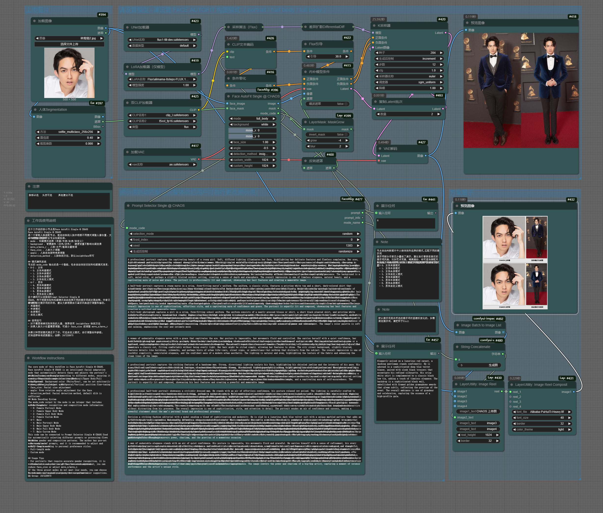

# ComfyUI_FaceAlignPaste

## 智能人脸对齐与提示词匹配节点集合 | Smart Face Alignment and Prompt Matching Node Collection

这是一个用于 ComfyUI 的人脸对齐和提示词匹配节点包，能够智能识别人脸、自动构图并匹配预设提示词，让您的人物图像处理工作流程更加高效和精准。

This is a node package for ComfyUI that provides face alignment and prompt matching capabilities, intelligently recognizing faces, automatically composing images, and matching preset prompts, making your character image processing workflow more efficient and precise.
---

## 功能特点 | Features

- **智能人脸检测** - 支持多种检测方法（insightface、OpenCV、MediaPipe、dlib），自动选择最佳结果
- **自动人脸对齐** - 根据人脸特征点智能对齐人脸，确保完美构图
- **精确定位系统** - 基于眼睛位置进行精确定位，实现专业级人像构图
- **智能缩放算法** - 根据人脸比例自动调整大小，保持人脸中心不变
- **多种构图模式** - 支持肖像、半身、全身等多种构图模式，满足不同创作需求
- **边界检查** - 自动检测并提示人物是否超出画布边界，避免意外裁剪
- **高质量图像处理** - 使用 Lanczos 插值等高质量算法确保图像清晰度
- **性别识别** - 自动识别单人图像中人物的性别，辅助提示词选择
- **提示词匹配** - 根据不同场景和性别组合自动匹配预设的专业提示词

---

**Smart Face Detection** - Supports multiple detection methods (insightface, OpenCV, MediaPipe, dlib), automatically selecting the best result  
**Automatic Face Alignment** - Intelligently aligns faces based on facial landmarks, ensuring perfect composition  
**Precise Positioning System** - Positions based on eye location for professional portrait composition  
**Smart Scaling Algorithm** - Automatically adjusts size based on face proportions while maintaining face center  
**Multiple Composition Modes** - Supports portrait, half-body, full-body and other composition modes for different creative needs  
**Boundary Check** - Automatically detects and alerts when characters exceed canvas boundaries to avoid accidental cropping  
**High-Quality Image Processing** - Uses high-quality algorithms like Lanczos interpolation to ensure image clarity  
**Gender Recognition** - Automatically recognizes the gender of characters in single-person images to assist prompt selection  
**Prompt Matching** - Automatically matches preset professional prompts based on different scenarios and gender combinations

---

## 节点说明 | Nodes Description

### 1. Face Align Single @ CHAOS

单人脸对齐节点，可以检测人脸并进行精确对齐处理，支持多种检测方法和对齐模式。

Single face alignment node that can detect faces and perform precise alignment, supporting multiple detection methods and alignment modes.

### 2. Face Align Double @ CHAOS

双人脸对齐节点，可以同时处理两张人脸图像并进行对齐，适用于人物对话场景或合影构图。

Double face alignment node that can process two face images simultaneously, suitable for character dialogue scenes or group photo compositions.

### 3. Face AutoFit Single @ CHAOS


智能人脸适配节点，可以将人脸图像智能地放置到指定尺寸的画布上，自动调整大小和位置，实现完美构图。主要参数包括构图模式、背景颜色、位置微调、人脸大小和旋转角度等。

Intelligent face auto-fitting node that can smartly place face images onto a canvas of specified size, automatically adjusting size and position for perfect composition. Main parameters include composition mode, background color, position fine-tuning, face size, and rotation angle.

### 4. Face AutoFit Double @ CHAOS


双人脸适配节点，可以同时处理两张人脸图像并放置在同一画布上，自动调整相对位置和大小，适合创建对话场景或人物互动图像。

Double face auto-fitting node that can process two face images simultaneously and place them on the same canvas, automatically adjusting relative position and size, ideal for creating dialogue scenes or character interaction images.

### 5. Image Rotate @ CHAOS


高质量图像旋转节点，提供精确的图像旋转功能，保持人脸中心不变，支持多种插值方法确保旋转后的图像质量。

High-quality image rotation node providing precise image rotation while maintaining face center, supporting multiple interpolation methods to ensure image quality after rotation.

### 6. Prompt Selector @ CHAOS



提示词选择器，提供多种人像场景的预设提示词模板，包括单人、双人不同性别组合的肖像、半身和全身构图提示词，可根据需要自由选择和定制。通常与 Face AutoFit 节点配合使用，实现一体化的人像生成工作流。

Prompt selector providing preset prompt templates for various portrait scenarios, including single-person and two-person compositions with different gender combinations for portrait, half-body, and full-body compositions. It is typically used in conjunction with Face AutoFit nodes to create integrated portrait generation workflows.

### 7. Gender Recognition @ CHAOS


性别识别节点，可以自动识别单人图像中人物的性别，为提示词选择和人像生成提供参考依据。该节点专为单人图像设计，能够准确判断人物性别，辅助后续的提示词选择和图像生成过程。

Gender recognition node that can automatically identify the gender of characters in single-person images, providing reference for prompt selection and portrait generation. This node is specifically designed for single-person images and can accurately determine the gender of the subject to assist in subsequent prompt selection and image generation processes.

---

## 安装方法 | Installation

1. 下载本仓库到 ComfyUI 的 `custom_nodes` 目录：

   Download this repository to the `custom_nodes` directory of ComfyUI:

```bash
cd "path_to_your_comfyui/ComfyUI/custom_nodes"
git clone https://github.com/CHAOSEA/ComfyUI_FaceAlignPaste.git

## 模型文件 | Model Files

本节点包含以下预训练模型文件：

- `models/shape_predictor_68_face_landmarks.dat` - dlib 人脸关键点检测模型，用于精确定位人脸的 68 个特征点

这些模型文件已包含在节点包中，无需单独下载。如果您遇到模型加载错误，请确保文件路径正确且文件完整。
### insightface 模型下载说明
本节点包使用 insightface 进行人脸检测和性别识别。insightface 模型会在首次使用时自动下载到以下位置：

 ```
ComfyUI/models/insightface/models
 ```

这是 ComfyUI 中多个使用 insightface 的节点共享的标准位置。如果您已经安装了其他使用 insightface 的节点（如 ComfyUI_IPAdapter_plus），可能已经下载了这些模型，本节点会直接使用现有模型，无需重复下载。

如果您的网络环境不佳，也可以手动下载模型并放置在上述目录中。主要需要的模型文件为：

- buffalo_l.zip - 人脸检测和特征提取模型（下载完记得解压）